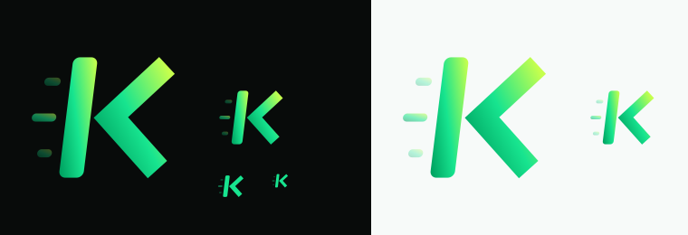

<div align="center">
  
</div>

# Kinetic

A GPS run tracker for iOS and Android. Records distance, pace, splits and elevation,
draws the route as a vector trace, and keeps a history you can browse by week, month
or all time. Dark by default, with a light theme and a system-follows setting.

---

## Running it

```bash
npm install
```

```bash
npx expo start
```

Scan the QR code with **Expo Go** on your phone. Location tracking needs a real
device — a simulator will report a fixed position and the run will never move.

Other targets:

```bash
npm run android
```

```bash
npm run web
```

Web is useful for working on layout and theming. `expo-location` resolves to the
browser Geolocation API there, so recording works but is not the real thing.

> **Expo Go can't run this app's headline feature.** Background location needs a
> foreground service and a registered background task, neither of which Expo Go
> provides. Use the APK below (or your own build) to test recording with the screen
> off.

## Building an APK

The native project is generated, not checked in. From a clean clone:

```bash
npx expo prebuild -p android --clean
```

Point Gradle at your SDK by creating `android/local.properties`:

```
sdk.dir=C\:\\Users\\<you>\\AppData\\Local\\Android\\Sdk
```

Then:

```bash
cd android && ./gradlew assembleRelease
```

The APK lands at `android/app/build/outputs/apk/release/app-release.apk`.

Installing on a device over USB:

```bash
adb install -r dist/Kinetic-1.0.0-arm64.apk
```

Requires JDK 17+ and the Android SDK (platform 36, build-tools 36).

### Why `arm64-v8a` only

`android/gradle.properties` pins `reactNativeArchitectures=arm64-v8a`. The generated
default is all four ABIs — `armeabi-v7a, arm64-v8a, x86, x86_64` — and under the New
Architecture every native module (screens, svg, reanimated, worklets, gesture-handler)
compiles its C++ **once per ABI**. Three of those four are for CPUs no modern phone
has; two are emulator-only. Dropping them cut the build from tens of minutes to about
two, with no loss of device coverage: arm64 is every Android phone since roughly 2016.

Add an ABI back if you need an x86 emulator:

```bash
cd android && ./gradlew assembleRelease -PreactNativeArchitectures=arm64-v8a,x86_64
```

## Tech

| | |
|---|---|
| **Expo SDK 57** / React Native 0.86 | One codebase, both platforms, no Xcode needed to iterate |
| **expo-router** | File-based routing — the tree under `app/` *is* the navigation graph |
| **TypeScript**, strict | |
| **zustand** | Three small stores instead of a context tree. Location fixes arrive ~1/sec; this keeps the re-render surface to the components that actually read the changing value |
| **react-native-svg** | The logo, every icon, the progress ring and the route trace are all vector — no raster assets to maintain at 4 densities |
| **AsyncStorage** | Runs and settings persist locally. No account, no backend, nothing leaves the device |

No map SDK. The route is projected and drawn directly (see below), which keeps the
app offline-capable and free of API keys.

## Layout

```
app/                        routes — the file tree is the nav graph
  _layout.tsx               providers, store hydration, root stack
  (tabs)/                   home · activity · stats · profile
  run.tsx                   pre-run and live recording
  activity/[id].tsx         run detail, doubles as the post-run summary

src/
  theme/tokens.ts           colour, space, radius, type, motion — the source of truth
  theme/ThemeProvider.tsx   resolves system/light/dark into a palette
  components/               Text, Surface, Button, Icon, Metrics, RouteTrace, …
  store/settings.ts         theme, units, weekly goal, toggles
  store/runs.ts             history + derived selectors (streak, PBs, buckets)
  store/tracker.ts          the live-run state machine
  lib/geo.ts                haversine, GPS filtering, projection, splits
  lib/format.ts             distance, pace, duration, dates — all unit-aware
  lib/seed.ts               deterministic demo history

scripts/generate-icons.mjs        SVG mark → app icon PNGs
scripts/build-design-system.mjs   tokens.ts → design-system/ preview pages
```

## Decisions worth knowing about

**GPS gets filtered before it counts.** Consumer GPS drifts several metres while you
stand still, and one bad fix can add hundreds of metres to a run. `isPlausible()` in
[`src/lib/geo.ts`](src/lib/geo.ts) drops fixes with accuracy worse than 35 m, movement
under 1.2 m, or implied speed over 12 m/s (faster than a world record, so it's a
glitch). Without this the distance inflates while you wait at a crossing.

**Moving time, not wall time.** The tracker accumulates completed running segments and
adds the live one, so pausing genuinely stops the clock and elapsed time survives the
app being backgrounded — it's computed from timestamps, not from counting ticks.

**Longitude is scaled by cos(latitude) before projection.** Without that correction a
north–south route renders visibly squashed and the trace stops being an honest picture
of where you went.

**Splits interpolate the boundary crossing.** Rather than attributing a whole GPS
segment to whichever kilometre it started in, `computeSplits()` finds the fractional
crossing point between the two fixes that straddle each marker. Sparse tracks would
otherwise smear the times.

**A pause breaks the track rather than joining across it.** Nothing is recorded while
paused, so the fix after a resume would otherwise connect straight to the one before
the pause — pause, take a bus, resume, and the ride is silently in your distance. It
passes the speed filter easily: one measured resume was 351.7 m over 60.2 s, an
implied 5.84 m/s, nowhere near the 12 m/s gate. So the first fix after a resume
carries a `break` flag, and every consumer skips the segment into it — distance,
splits, elevation and live pace alike. Split timing runs on elapsed-minus-pauses for
the same reason, or a kilometre containing a two-minute stop reads two minutes slow.

The flag travels through storage (`ActiveMeta.breakPending`) rather than memory,
because the fix that consumes it may be delivered to a headless context that never
saw the resume happen.

**Demo history is deterministic and self-retiring.** A fresh install seeds ten runs
from a fixed PRNG so every screen has something real to render. Routes are traced in
unit space, *measured*, then scaled to hit their target distance — sizing the geometry
up front doesn't work, because the wobble harmonics change the arc length by an amount
you can't know before drawing it. Recording your first real run deletes the whole demo
set, since mixing them would make the totals and streaks lie.

**The run action is not a tab.** It pushes a modal, so the tab bar is unreachable while
recording — a stray thumb can't abandon a run in progress.

## Design system

[`design-system/`](design-system) holds ten preview pages — brand, foundations,
components and screens — generated from `src/theme/tokens.ts`:

```bash
node scripts/build-design-system.mjs
```

Because they're generated from the same token module the app imports, they can't drift
from what ships. They're also published to **Claude Design** as the *Kinetic* project.

App icons regenerate from the same SVG geometry:

```bash
node scripts/generate-icons.mjs
```

## The mark

A geometric **K** leaning 7° into its direction of travel: a solid stem, a chevron
detached by a 2 pt counter, and three motion trails falling off the back edge. The
gradient runs deep green at the heel to lime at the leading tip — the energy arrives
where the letter is pointing.

The counter is the whole idea, and it's also the constraint: below about 20 px it
closes up and the letter reads as "I&lt;". Use the monochrome mark at small sizes.

## Background recording

Runs keep tracking with the screen off, while you're in another app, and after Kinetic
is swiped out of the recents list.

The thing that shapes this design: **Android can deliver background location to a
headless JS context** — a second copy of the bundle with its own module registry.
Nothing the UI holds in memory exists there, so a zustand store the task writes to is
a different store from the one on screen. Anything that only lived in memory would be
silently lost.

So the in-progress run lives in AsyncStorage ([`src/lib/activeRun.ts`](src/lib/activeRun.ts)),
and both contexts talk through it:

```
expo-location  ──▶  location task  ──▶  AsyncStorage  ──▶  tracker store  ──▶  UI
               (src/lib/locationTask.ts)  (durable)      (in-memory)
```

- The task is registered at **module scope** and imported for its side effect from
  `app/_layout.tsx`. Android can deliver a batch of fixes the instant the bundle
  finishes evaluating — registering inside a component is too late.
- Every fix is written to disk *first*. The store update after it is a no-op in a
  headless context and an instant UI refresh in the foreground, so one code path
  serves both and there's no second foreground watcher to double-count fixes.
- On `AppState → active` the store re-reads the buffer, catching up on everything
  recorded while nothing was rendering.
- **Crash recovery falls out of this for free.** If the OS kills the app mid-run, the
  track is already on disk; the next launch calls `restore()` and drops you straight
  back into the live run rather than onto a home screen that says nothing about the
  run still ticking in your notification shade.
- Pausing does not tear the service down — standing it back up costs several seconds
  of GPS reacquisition. The task just drops fixes while `segmentStartedAt` is null.

Android shows an ongoing notification while recording; that's what keeps location
flowing, and it's mandatory. iOS shows the blue location indicator.

**Permissions are requested in two steps** — foreground first, then "Allow all the
time". Android 11+ requires that order and suppresses the background prompt entirely
if you ask for both at once.

**Background access is an optimisation, never a requirement.** On Android 11+ the
"Allow all the time" request is not a dialog at all — it sends the user to the app's
settings page — so a perfectly normal grant leaves background *denied*. If it is
missing, `beginRecording()` falls back to an in-process `watchPositionAsync` through
the same durable write path, and the run screen says plainly that it is only recording
while Kinetic is open. Treating background as mandatory is how v1.0.0 shipped an app
that crashed the moment you pressed START.

**Nothing is written to the active-run buffer until recording has actually started.**
The ordering matters more than it looks: persisting "a run is live" and *then* trying
to start location means a failure leaves an unstartable run on disk, which the next
launch faithfully tries to resume — and fails at, identically, forever. `restore()`
therefore also starts no location updates at all; it restores state only, and the run
screen re-arms location once the app is genuinely foregrounded. Android 12+ forbids
starting a foreground service from a cold launch, so doing it during hydration is a
guaranteed crash on every open.

## Not built

- Audio cues and heart rate have settings toggles and display slots but no
  implementation behind them.
- No sync, accounts or sharing beyond the system share sheet.
- Release builds are signed with the React Native debug keystore — fine for
  sideloading, not for the Play Store.
